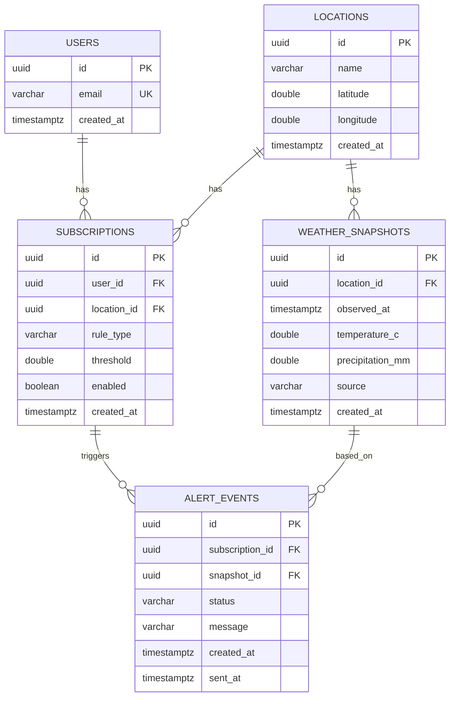

# Weather Alert Platform (Portfolio)

날씨 데이터를 **수집/저장/캐시/알림**까지 “운영 가능한 형태”로 구현한 백엔드 포트폴리오 프로젝트.

## 문제 정의

- 외부 날씨 API는 지연/실패/레이트리밋이 발생한다.
- 사용자는 “관심 지역 + 조건(예: 기온, 강수)”을 등록하고, 조건이 충족되면 알림을 받고 싶다.
- 트래픽이 늘어도 조회 API는 빠르고 안정적이어야 한다.
- 배치/스케줄러는 **중복 실행**되면 안 된다(멀티 인스턴스 고려).

## 요구사항(초안)

- 외부 날씨 API(Open-Meteo)로 지역별 현재 날씨를 주기적으로 수집한다.
- 수집 데이터는 PostgreSQL에 저장하고, 최신 값을 조회 API로 제공한다.
- 조회 API는 Redis 캐시(Cache-Aside + TTL)로 부하를 줄인다.
- 사용자는 관심 지역을 구독하고, 임계치 조건을 설정할 수 있다.
- 조건이 충족되면 알림 이벤트를 생성하고(Outbox), 별도 작업자가 발송 처리한다(데모: 로그).
- 스케줄 수집 작업은 분산 환경에서도 1회만 실행되도록 락을 건다(ShedLock).
- OpenAPI(Swagger UI)로 API 문서를 제공한다.
- 단위/통합 테스트를 최소 5개 이상 작성한다(외부 API는 mock).

## 아키텍처(초안)

```text
             +-------------------+
Client ----> |  REST API (Spring)| ----> Postgres (JPA/Flyway)
             |                   | ----> Redis (Cache TTL)
             |                   | ----> Open-Meteo (HTTP)
             +-------------------+
                       |
               Scheduler (Ingest + Dispatch)
                       |
                 Alert Outbox (DB)
```

## ERD(초안)



## API 목록(초안)

- `POST /api/v1/users` 유저 생성
- `POST /api/v1/locations` 지역 생성
- `GET /api/v1/locations` 지역 목록
- `GET /api/v1/locations/{locationId}/weather/current` 현재 날씨 조회(캐시)
- `POST /api/v1/subscriptions` 구독/조건 등록
- `GET /api/v1/users/{userId}/alerts` 알림 이벤트 조회

## 로컬 실행

### 1) Docker Compose(추천)

- `docker compose up -d --build`

Swagger UI: `http://localhost:8080/swagger-ui/index.html`

### 2) 인프라만 띄우고 로컬 실행(선택)

- `docker compose up -d postgres redis`
- (Java 17+ / Maven 필요) `mvn spring-boot:run`

## 의사결정 기록(ADR)

- `docs/adr/0001-alert-outbox.md`
- `docs/adr/0002-cache-strategy.md`
